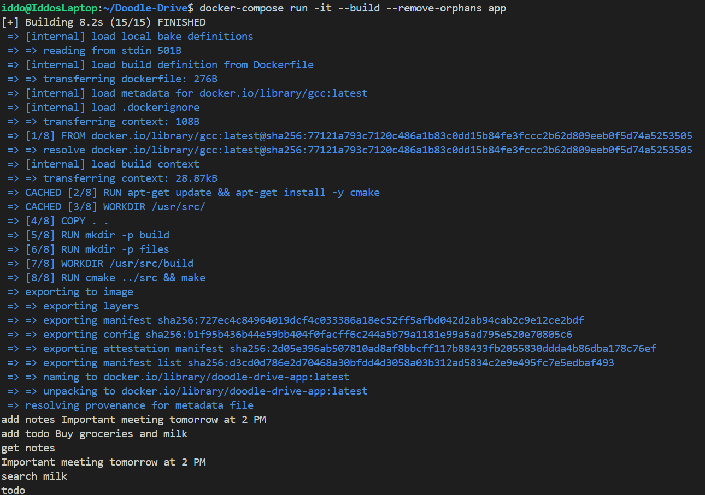
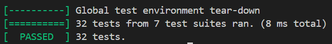

# Doodle-Drive
A command line interface for managing files, their contents, and searching within them.

This app was developed by Iddo Ben-Ari, Shahar Zuckerman, and Aviv Sayer
## Running

Run the application with Docker Compose:

```bash
docker-compose run -it --build --remove-orphans app
```

## Commands

**add** - Add a new file with content. The file name may not contain special characters or spaces.
```
add <filename> <content>
```
Example:
``` 
add notes Important meeting tomorrow at 2 PM
add todo Buy groceries and milk
```

**get** - Retrieve a file's contents. If the file does not exist, command is ignored.
```
get <filename>
```
Example:
``` 
get notes
```
**search** - Find files that contain a string (returns space-separated filenames). The content can be anything, and could even be empty by putting a space and then no content after it (would return all of the files)
```
search <search-term>
```
Example:
``` 
search milk
```

## Example


## Tests
Run tests with Docker Compose:
```bash
docker-compose run -it --build --remove-orphans gtest
```
Tests are located in the `tests` directory.
### Example Test Output
