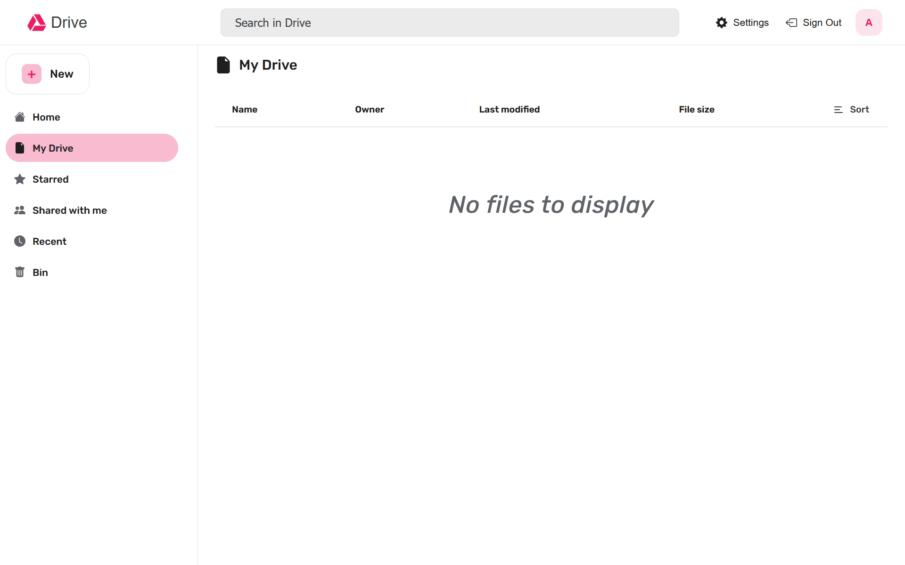
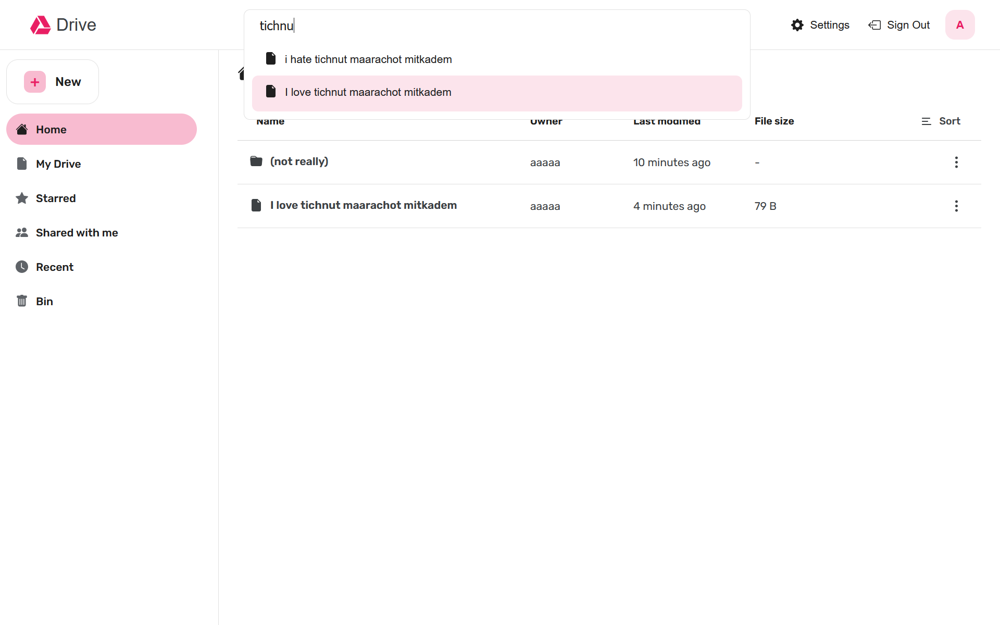
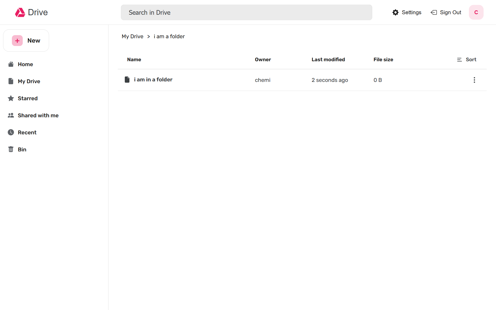
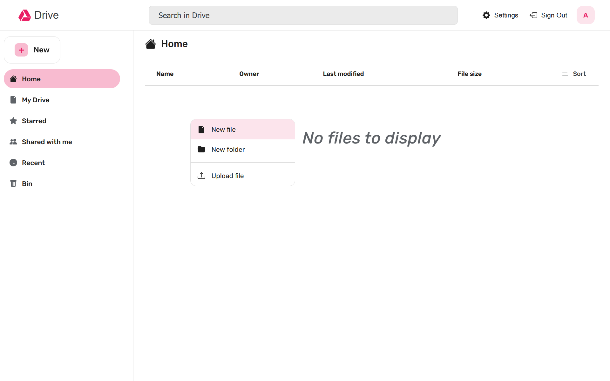
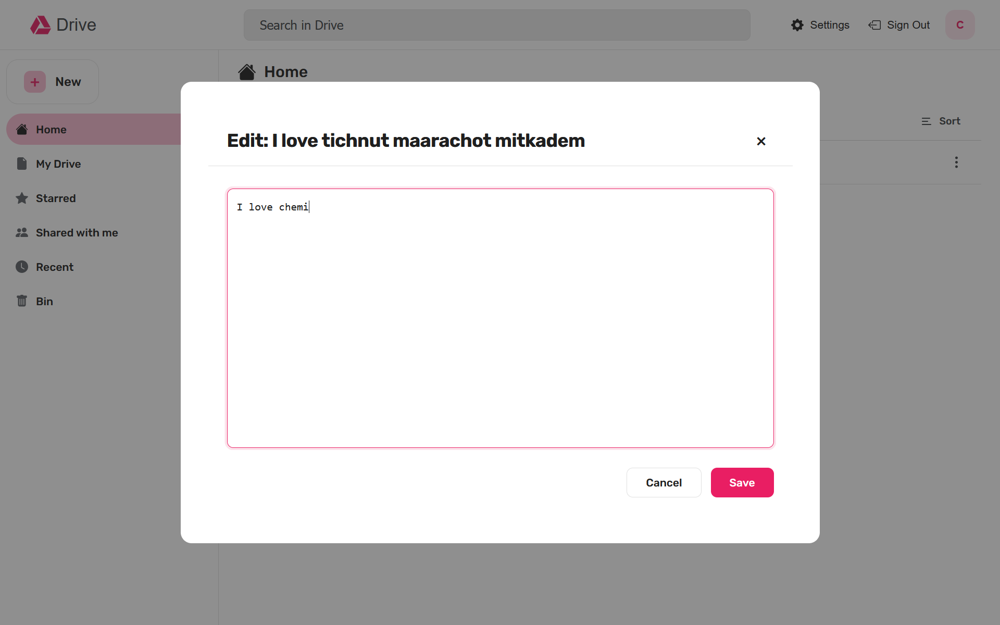

# Doodle Drive

## Overview
This project implements a distributed file system inspired by Google Drive, consisting of a React web server, NodeJS API Gateway and a C++ Backend Server.

## Project Structure
* **Web**: React website
* **API**: NodeJS Express Server (MVC Architecture)
* **Base**: C++ TCP Server

## Disabling Changes to Branches of Parts
To disable changes to branches of finished parts of the project, you create a ruleset in GitHub repository settings:
1. Go to "Settings" -> "Rules" -> "Rulesets" -> "New ruleset"
2. Name the ruleset (e.g. "No touching to completed assignments")
3. Under "Target branches", add the regex of "Part-*" (all of the completed parts branches start with "Part-")
4. Under "Rules", add the rules:
    * Restrict creations
    * Restrict updates
    * Restrict deletions
    * Require linear history
    * Block force pushes
5. Save the ruleset

## Installation & Running
The project is containerized using Docker. For running parts of the project (Base server, API and the Website), there are predefined bash files.
* **To enable the usage of the bash files**, you need to run this command in the root directory:
    ```bash
    chmod +x ./api-server.bash ./api-console.bash ./base-server.bash ./base-client.bash ./base-tests.bash ./website.bash
    ```

    For the objectively fake programmers who don't have bash (or even don't have git bash while using GitHub), each section that uses a bash file is accompanied by the commands to run it.

* **To start the backend base C++ server**, you need to run the `./base-server.bash` file:
    ```bash
    build=<true|false> name=<host_name> port=<port> threads=<thread_count> ./base-server.bash
    ```
    You can run the file without defining the `build`, `name`, `port`, `threads` variables, and it will sign them the default values `true`, `base-server`, `3000`, `10` each.

    If you don't have bash, you can run the following command:
    ```cmd
    docker-compose run <--build|> -d -p <port>:<port> -e THREADS=<thread_count> --name <host_name> base-server <port>
    ```

* **To run a C++/Python client on a base server**, you need to run the `./base-client.bash` file:
    ```bash
    build=<true|false> type=<1=cpp|2=python> name=<cpp_server_host_name> port=<cpp_server_port> ./base-client.bash
    ```
    You can run the file without defining the `build`, `type` variables, and it will sign them the default values `true`, and ask for the client type on runtime. Note that you are required to define the `name` and `port` variables to connect the client to the C++ backend server.

    If you don't have bash, you can start the server as shown above and run the following command:
    * **For a C++ client:**
        ```cmd
        docker-compose run <--build|> base-client-cpp <cpp_server_host_name> <cpp_server_port>
        ```
    * **For a Python client:**
        ```cmd
        docker-compose run <--build|> -it base-client-python <cpp_server_host_name> <cpp_server_port>
        ```

* **To run the tests for the backend base C++ server**, you need to run the `./base-tests.bash` file:
    ```bash
    build=<true|false> ./base-tests.bash
    ```
    You can run the file without defining the `build` variable, and it will sign it the default value `true`.

    If you don't have bash, you can run the following command:
    ```cmd
    docker-compose run <--build|> base-tests
    ```

* **To start the API server**, you need to run the `./api-server.bash` file:
    ```bash
    build=<true|false> server_name=<cpp_server_host_name> server_port=<cpp_server_port> name=<host_name> port=<port> timeout=<requests_timeout_ms> jwt_secret=<jwt_secret> ./api-server.bash
    ```
    You can run the file without defining the `build`, `name`, `port`, `timeout`, `jwt_secret` variables, and it will sign them the default values `true`, `api-server`, `3300`, `100`, `abcd` each. Note that you are required to define the `server_name` and `server_port` variables to connect the API server to the C++ backend server.

    If you don't have bash, you can start the server as shown above and run the following command:
    ```cmd
    docker-compose run <--build|> -d -p <port>:<port> -e JWT_SECRET="<jwt_secret>" --name <host_name> api-server <base_server_host_name> <base_server_port> <port> <timeout>
    ```

* **To get to an API server's console**, you can reply 'Y' in the end of `./api-server.bash` execution, or run the `./api-console.bash` file:
    ```bash
    name=<api_host_name> port=<api_port> ./api-console.bash
    ```
    You can run the file without defining the `name`, `port` variables, and it will sign them the default values `api-server`, `3300` each.

    If you don't have bash, you need first to run the base, API servers and then you can run the following command:
    ```cmd
    docker exec -it <api_server_name> sh
    ```
    TIP: Using the `bash` file you have a predefined sh console that is much more easy to use.


## Website Usage & Structure

The website is the frontend client for the Doodle Drive system, built with React.

### Structure
The application handles routing using `react-router-dom` and represents a file management system, like Google Drive, Key areas include:
* **Authentication**: Only authenticated users who have signed up, can use the system.
* **Drive Interface**: The core workspace for managing files, like Google Drive.

It includes, all CRUD operations for files, made simple with a UI and even a full file sharing system insipired by Google Drive.

### Authentication
Users must authenticate to access their drive.


### Drive Interface
The main layout structure:
* **Header**: Contains the application logo, the global search bar, and the user profile menu.
* **Sidebar**: Offers navigation to views like Home, My Drive, Starred, Shared, Recents and Bin, plus the "New" button that enables the adding of files and folder, and even the ability to upload files from your computer.
* **Content Area**: The file viewing system, contains file actions by hovering over a file, or right clicking them, the ability to open images and edit text files, and the ability to open folders and directly add files to them using right click.

#### Main Pages
The **Home View** aggregates important files.


The **My Drive** page is the root of your personal storage.


And all the other views Starred, Shared, Recents, Bin, Search and folder view (accessible by opening a folder), you can view for your own by runing the website as instructed above!

### Searching
Users can find files and folders by using the search bar.


### Directory Navigation
**Inside a Directory**, users can view specific contents of a folder by left clicking it, and even directly adding files/folders to it using right click.


### File Operations
#### Add Content
The "New" button allows creating filer, folder and uploading files.


#### Share Content
Files can be shared with other users by specifying their username and permissions.


#### Edit Content
Text files can be opened and edited directly within the website's editor (Images can also be opened (supported versions are: jpeg, jpg, png and webp))


#### Delete Content
Items can be removed and sent to the Bin (and restored when right clicking them inside the Bin view).


### Settings
The settings page includes themes (Pink (light), Soviet (dark)).


## API Usage Examples

For the full protocol, documentation can be found in [`base/README.md`](api/README.md).

### Startup Example
**Start the API server:** (connecting to C++ server at `base-server:3000`, with default variables)
```bash
server_name=base-server server_port=3000 ./api-server.bash
```

**Connect to the API server's console:** (with default variables)
```bash
./api-console.bash
```

### Possible Requests
* **Create user:**
    ```bash
    curl -i -X POST http://localhost:3300/api/users -H "Content-Type: application/json" -d '{"username": "USERNAME", "password": "PASSWORD", "info": {"image": "data:image/png;base64,BASE64/STRING", "description": "DESCRIPTION"}}'
    ```
    ```
    HTTP/1.1 201 Created
    X-Powered-By: Express
    Location: /api/users/ebe7aa8d-e2c0-496b-93ca-41f015cfe29b
    Date: Wed, 24 Dec 2025 20:35:34 GMT
    Connection: keep-alive
    Keep-Alive: timeout=5
    Content-Length: 0
    ```

* **Get user info:**
    ```bash
    curl -i http://localhost:3300/api/users/ebe7aa8d-e2c0-496b-93ca-41f015cfe29b
    ```
    ```
    HTTP/1.1 200 OK
    X-Powered-By: Express
    Content-Type: application/json; charset=utf-8
    Content-Length: 79
    ETag: W/"4f-n/7UR/+HDnWF83Yfto44xNgrJYw"
    Date: Wed, 24 Dec 2025 20:36:17 GMT
    Connection: keep-alive
    Keep-Alive: timeout=5

    {"id":"ebe7aa8d-e2c0-496b-93ca-41f015cfe29b","username":"USERNAME","info":{"image":"data:image/png;base64,BASE64/STRING","description":"DESCRIPTION"}}
    ```

* **Get all info by username and password:**
    ```bash
    curl -i http://localhost:3300/api/tokens -H "Content-Type: application/json" -d '{"username": "USERNAME", "password": "PASSWORD"}'
    ```
    ```
    HTTP/1.1 200 OK
    X-Powered-By: Express
    Content-Type: application/json; charset=utf-8
    Content-Length: 45
    ETag: W/"2d-NCQl3Cc/bgZV4e5JIj+cMb0/ayA"
    Date: Wed, 24 Dec 2025 21:24:47 GMT
    Connection: keep-alive
    Keep-Alive: timeout=5

    {"id":"ebe7aa8d-e2c0-496b-93ca-41f015cfe29b"}
    ```

* **Create a folder:**
    ```bash
    curl -i -X POST http://localhost:3300/api/files -H "Username: USERNAME" -H "Password: PASSWORD" -H "Content-Type: application/json" -d '{"name": "folder"}'
    ```
    ```
    HTTP/1.1 201 Created
    X-Powered-By: Express
    Location: /api/files/4a0ec9ae-751a-46ab-a3d6-4295a8df5082
    Date: Wed, 24 Dec 2025 20:54:09 GMT
    Connection: keep-alive
    Keep-Alive: timeout=5
    Content-Length: 0
    ```

* **Create a file**
    ```bash
    curl -i -X POST http://localhost:3300/api/files -H "Username: USERNAME" -H "Password: PASSWORD" -H "Content-Type: application/json" -d '{"name": "file.txt", "parent": "4a0ec9ae-751a-46ab-a3d6-4295a8df5082", "content": "Hello, World!"}'
    ```
    ```
    HTTP/1.1 201 Created
    X-Powered-By: Express
    Location: /api/files/31798e34-3b62-40b1-b3fe-cd46a494c85c
    Date: Wed, 24 Dec 2025 20:54:41 GMT
    Connection: keep-alive
    Keep-Alive: timeout=5
    Content-Length: 0
    ```

* **Get a file's content:**
    ```bash
    curl -i http://localhost:3300/api/files/31798e34-3b62-40b1-b3fe-cd46a494c85c -H "Username: USERNAME" -H "Password: PASSWORD"
    ```
    ```
    HTTP/1.1 200 OK
    X-Powered-By: Express
    Content-Type: application/json; charset=utf-8
    Content-Length: 153
    ETag: W/"99-9fQUOcXvxdwX6m8OJpfxLMXe6JI"
    Date: Wed, 24 Dec 2025 20:56:05 GMT
    Connection: keep-alive
    Keep-Alive: timeout=5

    {"id":"31798e34-3b62-40b1-b3fe-cd46a494c85c","name":"file.txt","type":"file","parent":"4a0ec9ae-751a-46ab-a3d6-4295a8df5082","content":"Hello, World!"}
    ```

* **Add user's permissions** to a file/folder:
    ```bash
    curl -i -X POST http://localhost:3300/api/files/4a0ec9ae-751a-46ab-a3d6-4295a8df5082/permissions -H "Username: USERNAME" -H "Password: PASSWORD" -H "Content-Type: application/json" -d '{"options": {"ebe7aa8d-e2c0-496b-93ca-41f015cfe29b": {"read": true, "write": true, "permissions": {"read": true, "write": true}}}}'
    ```
    ```
    HTTP/1.1 201 Created
    X-Powered-By: Express
    Location: /api/files/4a0ec9ae-751a-46ab-a3d6-4295a8df5082/permissions/97621e35-eb84-4e73-9fe4-781a8607aa60
    Date: Wed, 24 Dec 2025 21:04:04 GMT
    Connection: keep-alive
    Keep-Alive: timeout=5
    Content-Length: 0
    ```

* **Search a query:**
    ```bash
    curl -i http://localhost:3300/api/search/Hello -H "Username: USERNAME" -H "Password: PASSWORD"
    ```
    ```
    HTTP/1.1 200 OK
    X-Powered-By: Express
    Content-Type: application/json; charset=utf-8
    Content-Length: 2
    ETag: W/"2-l9Fw4VUO7kr8CvBlt4zaMCqXZ0w"
    Date: Wed, 24 Dec 2025 21:07:58 GMT
    Connection: keep-alive
    Keep-Alive: timeout=5

    {"31798e34-3b62-40b1-b3fe-cd46a494c85c": {"id": "31798e34-3b62-40b1-b3fe-cd46a494c85c", "name": "file.txt", "parent": "4a0ec9ae-751a-46ab-a3d6-4295a8df5082", "content": "Hello, World!"}}
    ```


## C++ Server Usage Examples

For the full protocol, documentation can be found in [`base/README.md`](base/README.md).

### Startup Example
**Start the server:** (with default variables)
```bash
./base-server.bash
```

**Then you can run your client of choice**:
* **Run a C++ client:** (connecting to server at `base-server:3000`)
    ```bash
    type=1 name=base-server port=3000 ./base-client.bash
    ```

* **Run a Python client:** (connecting to server at `base-server:3000`)
    ```bash
    type=2 name=base-server port=3000 ./base-client.bash
    ```

* **To start the website**, you need to run the `./website.bash` file:
    ```bash
    build=<true|false> name=<host_name> port=<port> ./website.bash
    ```
    You can run the file without defining the `build`, `name`, `port` variables, and it will sign them the default values `true`, `website`, `3000` each.

    If you don't have bash, you can run the following command:
    ```cmd
    docker-compose run <--build|> -d -p <port>:<port> --name <host_name> web <port>
    ```

### Commands Examples
* **Create a file:**
    ```
    POST Hello, World!
    ```
    ```
    201 Created
    ```

* **Read a file:**
    ```
    GET Hello,
    ```
    ```
    200 Ok

    World!
    ```

* **Search a string:**
    ```
    SEARCH orl
    ```
    ```
    200 Ok

    Hello,
    ```

* **Delete a file:**
    ```
    DELETE Hello,
    ```
    ```
    204 No Content
    ```
